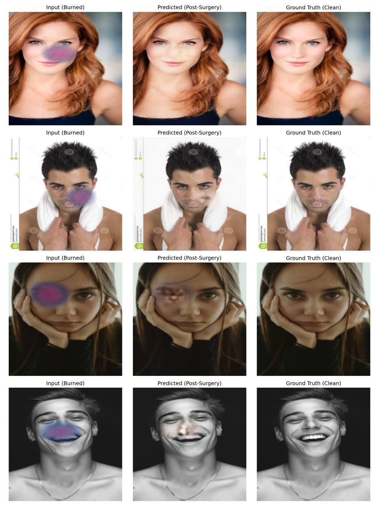

# Post-Surgery Facial Reconstruction: Burn Scar Prediction & Removal

This project utilizes Deep Learning (GANs) to predict post-surgery facial appearance by digitally removing severe burn scars. Due to the scarcity of paired pre-and-post-operative datasets, we developed a pipeline to generate synthetic realistic burn data, which was then used to train a U-Net Generator with a PatchGAN Discriminator to reconstruct the original facial features.

## Datasets

We created a synthetic dataset by applying algorithmically generated burns to the "Human Faces" dataset.

- **Original Dataset**: [Human Faces (Kaggle)](https://www.kaggle.com/datasets/ashwingupta3012/human-faces)
- **Modified Dataset (Training Data)**: [Burn Scar Faces with Original (Kaggle)](https://www.kaggle.com/datasets/amanrajpathak/burn-scar-faces-with-original)

## Project Results

Below is an example of the model's output after training. The model takes the image with synthetic burns (left) and predicts the post-surgery clean skin (center), comparing it to the ground truth (right).

## Deep Learning Flow & Methodology

The project consists of two main phases: **Synthetic Data Generation** and **Model Training**.

### Phase 1: Synthetic Data Generation

Since real-world paired data for burn surgery is sensitive and scarce, we engineered a `RealisticBurnGenerator` using OpenCV and Python.

- **Face Detection**: Uses Haar Cascades to strictly confine effects to facial regions.
- **Masking & Noise**: Generates elliptical burn masks combined with Fractal Noise to simulate irregular organic textures.
- **Color Blending**: Applies LAB color space manipulation to simulate severe burns, varying Luminance (L) and color channels (A, B) for realism.
- **Texture Simulation**: Adds specular highlights to simulate blistering and Gaussian blurring to feather edges into healthy skin.

### Phase 2: Model Architecture (Pix2Pix GAN)

We implemented a Generative Adversarial Network (GAN) specifically designed for Image-to-Image translation.

#### 1. The Generator (U-Net)

- **Architecture**: A U-Net Encoder-Decoder architecture with skip connections.
- **Function**: It takes the "Burned" image as input and downsamples it to capture context, then upsamples it to reconstruct the "Clean" face.
- **Skip Connections**: Essential for preserving high-frequency details (like eyes and mouth edges) that would otherwise be lost during downsampling.

#### 2. The Discriminator (PatchGAN)

- **Architecture**: A Convolutional PatchGAN classifier.
- **Function**: Instead of classifying the whole image as "Fake" or "Real", it classifies $70 \times 70$ overlapping patches of the image. This forces the Generator to focus on high-frequency local textures (sharp skin texture) rather than just avoiding blurriness.

#### 3. Training Process & Loss Functions

The model was trained to minimize a composite loss function:

- **Adversarial Loss (GAN Loss)**: Forces the generator to create images that the discriminator cannot distinguish from real images.
- **L1 Loss**: A pixel-wise loss that ensures the generated face structurally matches the ground truth.
- **Perceptual Loss (VGG16)**: We extract features from a pre-trained VGG16 network. The loss minimizes the difference between the features of the generated image and the real image. This ensures the result looks perceptually similar to a human eye, rather than just mathematically close in pixel values.

## Installation & Usage

### Dependencies

- Python 3.x
- PyTorch & Torchvision
- OpenCV (cv2)
- NumPy & SciPy
- Matplotlib

### Running the Project

1. **Data Generation**: Run `dlproject-dataset-generation.ipynb` to process raw face images and create the with_burns vs original pairs.
2. **Training**: Run `dl-model-train-working1.ipynb`. This notebook loads the dataset, initializes the U-Net and Discriminator, and runs the training loop using the combined Loss function.

## Contributors

This project was developed by:

- **Dev Bhardwaj** ([@devbhardwaj012](https://github.com/devbhardwaj012))
- **Aman Raj Pathak** ([@pathak-amanraj](https://github.com/pathak-amanraj))

### Guidance & Supervision:
Under the guidance of **Professor Laxmi Priya**
